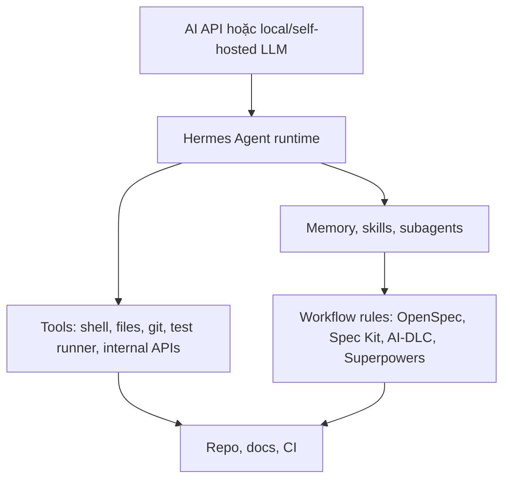
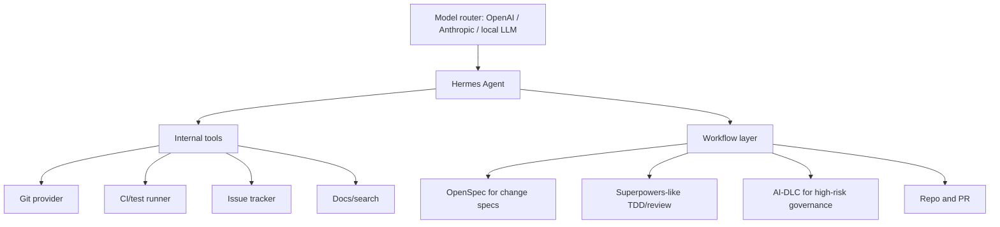

# Hermes Agent

Hermes Agent nên được hiểu là **open-source, hackable agent runtime/CLI**. Nó nằm cùng tầng kiến trúc với Codex CLI, Claude Code, OpenCode hoặc các coding agent harness khác, không cùng tầng với Spec Kit hay OpenSpec.

Nguồn chính:

- GitHub: <https://github.com/NousResearch/hermes-agent>
- Hugging Face integration docs: <https://huggingface.co/docs/inference-providers/main/en/integrations/hermes-agent>

## Hermes nằm ở đâu?

Hermes trả lời:

> Làm sao chạy, customize và mở rộng một AI agent?

Workflow frameworks trả lời:

> Agent nên làm việc theo quy trình nào?

## Hermes mạnh ở đâu?

Hermes đáng quan tâm khi bạn cần:

| Nhu cầu | Vì sao Hermes hữu ích |
|---|---|
| Open-source agent runtime | Có thể inspect, modify, self-host harness |
| Dùng API hoặc local/self-hosted model | Harness layer có thể tùy biến theo model strategy |
| Custom tools | Có thể tích hợp internal APIs, shell tools, repo tools, research tools |
| Memory và skills | Hermes nhấn mạnh memory, skills và học từ work trước |
| Subagents | Hữu ích cho workstreams song song hoặc chuyên biệt |
| Internal agent platform | Phù hợp hơn một coding assistant đóng gói sẵn |
| Agent research | Playground tốt cho runtime, memory và orchestration experiments |

## Hermes không phải gì?

Hermes không chủ yếu là:

- spec framework như Spec Kit;
- change-spec system như OpenSpec;
- enterprise lifecycle governance như AWS AI-DLC;
- project execution workflow như GSD;
- TDD/review methodology như Superpowers.

Nó có thể chạy hoặc hỗ trợ các workflow đó, nhưng không thay thế artifact model của chúng.

## Hermes vs workflow frameworks

| Câu hỏi | Hermes | Spec Kit / OpenSpec / AI-DLC / GSD / Superpowers |
|---|---|---|
| Tầng nào? | Agent runtime/harness | Workflow/methodology/artifact layer |
| Quan tâm chính | Tools, memory, skills, subagents, execution | Specs, plans, approvals, tasks, tests, review |
| Source of truth | Không phải concept chính | Concept trung tâm |
| Governance | Cần process bổ sung | AI-DLC đặc biệt mạnh ở đây |
| Use tốt nhất | Build/customize agent platform | Định hình agent làm việc thế nào |

## Khi nào nên dùng Hermes?

Dùng Hermes khi:

1. Muốn self-host hoặc customize sâu agent.
2. Cần local/self-hosted LLM hoặc model routing linh hoạt.
3. Muốn memory/skills/subagents như runtime capabilities.
4. Đang build internal AI agent platform.
5. Muốn research hoặc sửa agent loop.

Đừng thêm Hermes chỉ vì nó tồn tại. Nếu Codex CLI hoặc Claude Code đã giải quyết tốt workflow code hằng ngày, Hermes có thể chỉ thêm complexity.

## Khi nào không nên dùng Hermes?

Tránh thêm Hermes khi:

- chỉ cần coding CLI polished;
- vấn đề là requirement mơ hồ, không phải runtime customization;
- cần enterprise governance nhưng chưa có AI-DLC-like controls;
- team không muốn vận hành custom agent runtime;
- không cần custom tools, memory, skills hoặc self-hosting.

## Kết hợp Hermes với workflow frameworks

| Combo | Ý nghĩa |
|---|---|
| Hermes + OpenSpec | Hermes execute; OpenSpec sở hữu change specs |
| Hermes + Spec Kit | Hermes execute tasks sinh từ specs/plans |
| Hermes + AI-DLC | Hermes execute; AI-DLC sở hữu governance, state, audit |
| Hermes + Superpowers | Hermes dùng TDD/review/brainstorming skills như discipline |
| Hermes + GSD | Có overlap; phải quyết định ai sở hữu memory và multi-agent execution |

## Kiến trúc mẫu: internal AI coding platform

## Step-by-step adoption

1. Bắt đầu với một repo low-risk.
2. Quyết định model strategy: hosted API, local LLM hoặc router.
3. Cài và chạy Hermes trong môi trường kiểm soát.
4. Chỉ thêm minimum tools trước: file read/write, git, shell, tests.
5. Thêm một workflow layer: OpenSpec hoặc Superpowers là lựa chọn đầu tốt.
6. Định nghĩa Hermes được làm gì không cần approval.
7. Thêm logging và audit cho tool calls.
8. Chạy một pilot task.
9. So sánh output với Codex CLI hoặc Claude Code.
10. Chỉ adopt nếu Hermes có lợi thế rõ.

## Production concerns

Nếu dùng Hermes như internal platform, hãy coi nó như infrastructure:

| Concern | Quyết định cần có |
|---|---|
| Secrets | Credentials scoped và rotated thế nào? |
| Tool permissions | Agent được chạy commands/APIs nào? |
| Memory retention | Lưu gì, bao lâu, ai truy cập được? |
| Model routing | Task nào được dùng model nào? |
| Audit logs | Tool calls và decisions có được ghi lại không? |
| Kill switch | Human có dừng runaway execution được không? |
| Evaluation | Đo chất lượng agent theo thời gian thế nào? |

