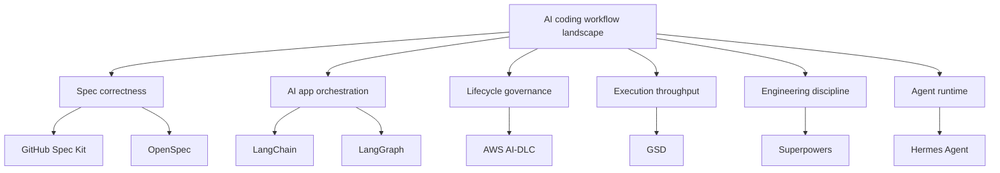

# Hướng dẫn AI Engineering Workflow và Agent Runtime

Tài liệu này giải thích các AI engineering workflow frameworks và agent harness/runtime tools dưới góc nhìn của AI solution architect và engineering lead.

Thứ tự đọc được thiết kế như sau:

1. Nền tảng: hiểu AI-DLC và Spec-Driven Development.
2. Agent runtime layer: hiểu Hermes, Codex CLI, Claude Code nằm ở tầng nào.
3. Đi sâu từng framework: hiểu từng framework theo đúng bản chất của nó.
4. So sánh: chỉ so sánh sau khi đã có đủ context.
5. Áp dụng: chọn workflow và harness theo team, mức rủi ro và loại codebase.

## Bắt đầu bằng bản đồ stack

Nếu bạn bị rối vì framework nào cũng có vẻ giống `plan -> implement -> review`, hãy bắt đầu với [Bản đồ AI Engineering Stack](./stack/). Trang này giải thích mỗi framework sở hữu layer nào trước khi đi vào so sánh từng tool.

  <a class="framework-card" href="./stack/">
    <h3>AI Engineering Stack</h3>
    
Bản đồ đầy đủ của workflow, harness, app framework, model, RAG, tools, evals và governance.

  </a>
  <a class="framework-card" href="./app-frameworks/langchain">
    <h3>LangChain</h3>
    
Framework để build LLM apps và tool-calling agents.

  </a>
  <a class="framework-card" href="./app-frameworks/langgraph">
    <h3>LangGraph</h3>
    
Stateful orchestration framework cho long-running agent systems.

  </a>
  <a class="framework-card" href="./frameworks/spec-kit">
    <h3>GitHub Spec Kit</h3>
    
Spec-first delivery: intent trở thành spec, plan, tasks và implementation.

  </a>
  <a class="framework-card" href="./frameworks/openspec">
    <h3>OpenSpec</h3>
    
SDD nhẹ, artifact-guided, có change folder, delta specs và iteration linh hoạt.

  </a>
  <a class="framework-card" href="./frameworks/aws-ai-dlc">
    <h3>AWS AI-DLC Workflows</h3>
    
Lifecycle governance cho AI-driven development, có approval và audit trail.

  </a>
  <a class="framework-card" href="./frameworks/gsd">
    <h3>GSD / Get Shit Done</h3>
    
Context engineering và multi-agent execution cho dự án dài ngày.

  </a>
  <a class="framework-card" href="./frameworks/superpowers">
    <h3>Superpowers</h3>
    
Engineering discipline skills: brainstorm, design, TDD, review, finish.

  </a>
  <a class="framework-card" href="./harnesses/hermes">
    <h3>Hermes Agent</h3>
    
Open-source, hackable agent runtime/CLI cho memory, tools, skills và subagents.

  </a>

## Định hướng nhanh

| Nếu nỗi đau lớn nhất là... | Bắt đầu với |
|---|---|
| Cần bản đồ kiến trúc AI engineering đầy đủ | [Bản đồ stack](./stack/) |
| Cần chất lượng production cho AI app | [Evals và Observability](./stack/evals-observability) |
| Cần dùng tools an toàn và governance cho agent | [Tools/MCP](./stack/tools-mcp) và [Security/Governance](./stack/security-governance) |
| Requirement mơ hồ, agent hay đoán | [GitHub Spec Kit](./frameworks/spec-kit) |
| Muốn SDD nhẹ, linh hoạt, ít gate hơn | [OpenSpec](./frameworks/openspec) |
| Enterprise cần approval, traceability, NFR và audit | [AWS AI-DLC Workflows](./frameworks/aws-ai-dlc) |
| Dự án dài ngày, agent hay mất context | [GSD / Get Shit Done](./frameworks/gsd) |
| Agent code quá nhanh, thiếu test/design/review | [Superpowers](./frameworks/superpowers) |
| Muốn self-host hoặc customize agent runtime | [Hermes Agent](./harnesses/hermes) |

## Lộ trình đọc đề xuất

1. [AI-DLC](./foundations/ai-dlc)
2. [Spec-Driven Development](./foundations/sdd)
3. [Bản đồ AI Engineering Stack](./stack/)
4. [Tầng model và serving](./stack/model-serving)
5. [Data, RAG và Retrieval](./stack/data-rag)
6. [Tools, MCP và Gateway](./stack/tools-mcp)
7. [Evals và Observability](./stack/evals-observability)
8. [Security và Governance](./stack/security-governance)
9. [Agent Harness vs Workflow](./foundations/agent-harness-vs-workflow)
10. [LangChain](./app-frameworks/langchain)
11. [LangGraph](./app-frameworks/langgraph)
12. [LangChain/LangGraph vs Hermes](./app-frameworks/langchain-langgraph-hermes)
13. [GitHub Spec Kit](./frameworks/spec-kit)
14. [OpenSpec](./frameworks/openspec)
15. [AWS AI-DLC Workflows](./frameworks/aws-ai-dlc)
16. [GSD / Get Shit Done](./frameworks/gsd)
17. [Superpowers](./frameworks/superpowers)
18. [Hermes Agent](./harnesses/hermes)
19. [Codex CLI vs Claude Code vs Hermes](./harnesses/codex-claude-hermes)
20. [Ma trận so sánh](./compare/)
21. [Cùng flow, khác mục đích](./compare/same-flow-different-purpose)
22. [Hướng dẫn chọn](./compare/decision-guide)
23. [Kết hợp framework](./compare/combinations)
24. [Use case thực tế](./compare/use-cases)
25. [Playbook triển khai](./compare/adoption)
26. [Expert review](./compare/expert-review)
