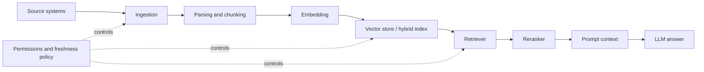

# Data, RAG và Retrieval

Tầng Data/RAG biến tri thức của tổ chức thành context có kiểm soát cho model. Đây là nơi documents, databases, tickets, policies, code và product knowledge trở thành evidence có thể retrieve.

RAG không chỉ là vector database. RAG là toàn bộ pipeline biến dữ liệu doanh nghiệp thành context có kiểm soát cho model.

## Layer này sở hữu điều gì

| Mối quan tâm | Quyền sở hữu |
|---|---|
| Source selection | System và document nào được phép đi vào AI context |
| Ingestion | Content đi vào index như thế nào |
| Parsing | PDFs, HTML, code, tables, docs, tickets biến thành text/metadata ra sao |
| Chunking | Content được chia nhỏ như thế nào để retrieve |
| Embedding và indexing | Meaning và keywords trở thành searchable như thế nào |
| Retrieval | Chọn đúng chunks như thế nào |
| Reranking | Sắp xếp candidates theo relevance ra sao |
| Grounding | Answer cite và dùng retrieved context như thế nào |
| Freshness | Stale content được phát hiện hoặc loại bỏ ra sao |
| Permissions | User access được enforce tại retrieval time như thế nào |

## RAG pipeline

## Permission-aware retrieval

Permission-aware retrieval nghĩa là hệ thống chỉ retrieve những gì user, tenant, role hoặc service hiện tại được phép xem.

Đừng dựa vào model để "tự bỏ qua" nội dung bị cấm. Retriever phải filter trước khi context đi vào model.

| Pattern | Khi nào dùng |
|---|---|
| Metadata filter | Tenant, department, role, document type |
| ACL sync | Enterprise documents có access rules sẵn |
| Query-time policy check | Sensitive systems hoặc mixed data classes |
| Separate indexes | Hard isolation giữa tenants hoặc regulated domains |
| Redaction pipeline | PII, secrets, contractual data |

## RAG quality levers

| Lever | Có thể lỗi gì | Cách cải thiện |
|---|---|---|
| Source quality | documents cũ, trùng, mâu thuẫn | source curation và freshness rules |
| Parsing quality | mất tables/code/images | document-aware parsing |
| Chunk size và overlap | context quá nhỏ hoặc quá nhiễu | evaluate chunk settings theo query type |
| Embedding model | semantic matches yếu | so sánh embeddings trên real queries |
| Vector vs hybrid retrieval | keyword-heavy queries fail | kết hợp vector và keyword retrieval |
| Reranking | candidates tốt bị chôn dưới | rerank top-k candidates |
| Citation và grounding | model trả lời không evidence | bắt buộc citations và context checks |
| Freshness | policies cũ trả lời câu hỏi hiện tại | version và expiry metadata |
| Access control | data leakage | filter trước prompt construction |
| Eval datasets | quality không đo được | tạo golden queries và expected evidence |

## LangChain và LlamaIndex nằm ở đâu

LangChain có thể orchestrate RAG flow bên trong AI application: loaders, retrievers, tools, prompts và chains. LlamaIndex thường hợp khi data/indexing layer là trọng tâm, đặc biệt là document ingestion, indexing abstractions, retrieval strategies và knowledge workflows.

Các framework này không thay governance. Dùng OpenSpec hoặc Spec Kit để định nghĩa RAG feature, AI-DLC cho high-risk delivery và eval/observability tools để chứng minh behavior.

## Hướng dẫn implement RAG step-by-step

1. Định nghĩa lớp câu hỏi của user: support, policy, product docs, code search, analytics.
2. Định nghĩa allowed sources và data owners.
3. Định nghĩa permissions trước khi indexing.
4. Tạo golden dataset nhỏ: 30-100 câu hỏi đại diện với expected source evidence.
5. Ingest một source set hẹp trước.
6. Parse và chunk với metadata: source, owner, freshness, tenant, ACL, version.
7. So sánh retrieval strategies: vector, keyword, hybrid, rerank.
8. Build answer generation có citations.
9. Thêm refusal behavior khi thiếu evidence.
10. Chạy evals trong CI trước khi đổi chunking, prompts, retrievers hoặc models.

## Failure modes

| Failure mode | Dấu hiệu | Cách sửa |
|---|---|---|
| Xem vector DB là toàn bộ RAG system | answers không ổn định, khó debug | thiết kế full pipeline |
| Không golden dataset | mỗi prompt change đều cảm tính | tạo query/evidence evals |
| Không permission filter | confidential chunks lọt vào prompt | enforce ACL trước retrieval output |
| Stale index | policy cũ được cite | freshness metadata và re-index jobs |
| Retrieved context quá nhiều | model bỏ qua facts quan trọng | reranking và context compression |
| Không yêu cầu citation | hallucination trông rất tự tin | grounded answer format |

## References

- [LangChain overview](https://docs.langchain.com/oss/python/langchain/overview)
- [LlamaIndex docs](https://docs.llamaindex.ai/)
- [LangSmith docs](https://docs.smith.langchain.com/)
- [Langfuse docs](https://langfuse.com/docs)
- [Arize Phoenix docs](https://docs.arize.com/phoenix)
