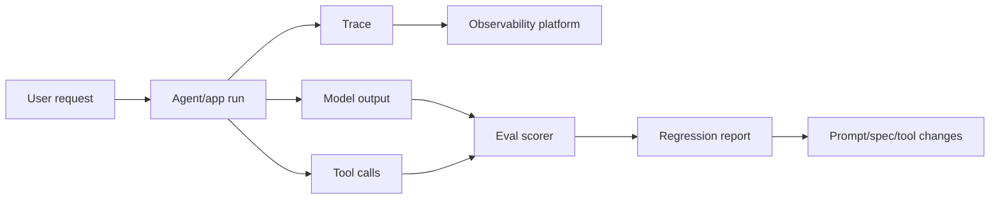

# Evals và Observability

Evals và observability là tầng feedback cho production. Nó trả lời câu hỏi đơn giản: làm sao biết AI system vẫn hành xử đúng sau khi prompts, tools, retrieval, models hoặc workflows thay đổi?

Unit test chứng minh code deterministic hoạt động. AI eval chứng minh hành vi xác suất của model, prompt, retrieval và tool path vẫn đạt chuẩn qua thời gian.

## Layer này sở hữu điều gì

| Mối quan tâm | Output |
|---|---|
| Tracing | timeline đầy đủ qua model calls, retrieval, tools, prompts |
| Quality evals | pass/fail hoặc score trên representative cases |
| Regression detection | change mới có làm behavior tệ hơn không |
| Prompt/version tracking | prompt nào sinh result nào |
| Dataset management | golden questions, expected evidence, edge cases |
| Cost và latency | token use, model route, end-to-end duration |
| Debugging | vì sao answer hoặc action xảy ra |
| Release gates | change có được ship không |

## Traditional tests vs AI evals

| Test type | Hợp nhất cho | Ví dụ |
|---|---|---|
| Unit test | deterministic code | parser trả expected JSON |
| Integration test | API/tool wiring | CRM tool tạo draft ticket |
| Contract test | schema compatibility | tool args khớp OpenAPI schema |
| Retrieval eval | context quality | expected policy doc nằm trong top 5 |
| Generation eval | answer quality | answer grounded và complete |
| Agent trajectory eval | path quality | agent hỏi approval trước write action |
| Safety eval | refusal và policy behavior | prompt injection không kích hoạt unsafe tool |

## Golden dataset pattern

Golden dataset là tập case đại diện được curate để định nghĩa expected behavior. Nó nên có normal cases, edge cases, negative cases và high-risk cases.

| Dataset field | Ví dụ |
|---|---|
| Input | user question hoặc task |
| Expected evidence | documents, code files, records hoặc facts nên được dùng |
| Expected behavior | answer, refusal, tool call, approval request |
| Risk tag | security, privacy, legal, operational, product |
| Evaluation method | exact match, rubric score, LLM judge, human review |

## Trace-first debugging

Khi AI system fail, đừng bắt đầu bằng việc sửa prompt. Hãy inspect trace trước:

1. Instruction nào đang active?
2. Context nào được retrieve?
3. Model nào được dùng?
4. Tool nào được gọi?
5. Arguments nào được truyền?
6. Guardrail hoặc approval gate nào được kích hoạt?
7. Eval case nào nên bắt lỗi này lần sau?

## Metrics quan trọng

| Metric | Vì sao quan trọng |
|---|---|
| Answer correctness | product value |
| Grounding/citation rate | trust và auditability |
| Retrieval precision/recall | RAG quality |
| Tool success/failure rate | operational reliability |
| Unsafe action attempts | security signal |
| Human approval rate | sức khỏe autonomy boundary |
| Cost per successful task | business scalability |
| Latency percentiles | user experience |
| Regression rate | release quality |

## Tooling map

| Tool/category | Vai trò |
|---|---|
| LangSmith | tracing và eval workflows cho LangChain/LangGraph |
| Langfuse | open-source LLM observability và prompt/eval tracking |
| Phoenix | tracing, evals và ML/LLM observability |
| OpenTelemetry | vendor-neutral telemetry standard |
| CI eval gate | ngăn regression được merge |

## Hướng dẫn adoption step-by-step

1. Instrument traces trước khi tối ưu prompts.
2. Tạo 30-50 golden cases cho workflow giá trị cao nhất.
3. Thêm retrieval evals nếu app dùng RAG.
4. Thêm tool trajectory evals nếu agent có thể thực hiện actions.
5. Chạy evals local khi development và trong CI cho critical changes.
6. Track prompt version, model route, retrieval configuration và tool version.
7. Đặt failure thresholds theo risk tier.
8. Review eval failures hằng tuần và chuyển incidents thành cases mới.

## Failure modes

| Failure mode | Dấu hiệu | Cách làm tốt hơn |
|---|---|---|
| Không traces | failures được tranh luận bằng screenshots | trace mọi run |
| Chỉ có unit tests | code pass nhưng AI behavior regress | thêm behavioral evals |
| Evals quá generic | score đẹp nhưng user phàn nàn | dùng real tasks và edge cases |
| Không dataset ownership | evals xuống cấp theo thời gian | assign owner và review cadence |
| Chỉ dùng LLM judge | quality signal flaky | kết hợp deterministic checks, rubric và human review |
| Không CI gate | regressions ship lặp lại | block high-risk changes bằng eval threshold |

## References

- [LangSmith docs](https://docs.smith.langchain.com/)
- [Langfuse docs](https://langfuse.com/docs)
- [Arize Phoenix docs](https://docs.arize.com/phoenix)
- [OpenTelemetry](https://opentelemetry.io/)
- [LangGraph overview](https://docs.langchain.com/oss/python/langgraph/overview)
