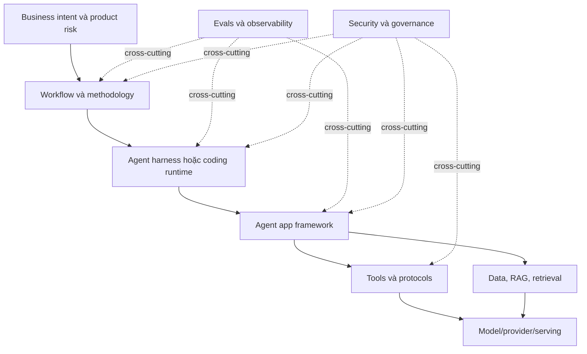
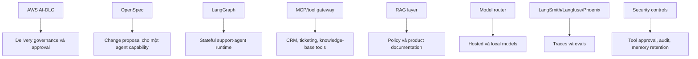

# Bản đồ AI Engineering Stack

Trang này là bản đồ tư duy cho toàn bộ guide. Ý chính rất đơn giản: nhiều công cụ AI trông giống nhau vì đều có planning, execution, review và iteration. Chúng khác nhau vì hoạt động ở các layer khác nhau trong AI engineering stack.

Các framework có vẻ giống nhau vì đều có plan, implement, review, iterate. Chúng khác nhau vì mỗi framework sở hữu một layer khác nhau trong stack.

Nếu so sánh sai layer, mọi thứ sẽ mơ hồ. LangGraph, Hermes, AWS AI-DLC, Spec Kit và MCP đều có thể xuất hiện trong một hệ thống agentic, nhưng chúng không giải quyết cùng một vấn đề.

## Stack tổng thể

## Bản đồ các layer

| Layer | Ví dụ | Câu hỏi chính | Output |
|---|---|---|---|
| Workflow/methodology | Spec Kit, OpenSpec, AWS AI-DLC, GSD, Superpowers | Human và agent nên delivery software như thế nào? | Specs, plans, approvals, tests, reviews |
| Agent harness/runtime | Codex CLI, Claude Code, Hermes | Agent chạy với tools, memory, filesystem và subagents như thế nào? | Tool calls, code changes, terminal actions |
| Agent app framework | LangChain, LangGraph, LlamaIndex, Semantic Kernel | Làm sao build AI application hoặc long-running agent service? | Chains, graphs, agents, state machines |
| Tool/protocol layer | MCP, OpenAPI tools, function calling, tool gateways | Model được phép làm gì một cách an toàn? | Tool schemas, policies, audit events |
| Data/RAG layer | Embeddings, vector DBs, retrievers, rerankers | AI dùng tri thức nào? | Indexed content, retrieved context, citations |
| Model/serving layer | OpenAI, Anthropic, local LLMs, vLLM, Ollama, LiteLLM | Model nào chạy inference và chạy như thế nào? | Responses, tool calls, token/cost/latency profile |
| Evals/observability | LangSmith, Langfuse, Phoenix, OpenTelemetry | Làm sao biết hệ thống vẫn chạy đúng? | Traces, eval scores, regression results |
| Security/governance | RBAC, sandboxing, audit logs, approval gates | Điều gì được phép, được review và ai chịu trách nhiệm? | Policies, logs, approvals, risk records |

## Vì sao dễ bị rối

Các layer khác nhau dùng lại cùng một nhóm động từ:

| Động từ | Trong workflow frameworks | Trong app frameworks | Trong harnesses |
|---|---|---|---|
| Plan | Plan feature hoặc delivery unit | Plan execution path của agent | Plan terminal/file actions |
| Implement | Sinh code từ specs/tasks | Chạy node/chain/tool path | Sửa file và chạy command |
| Review | Review spec, design, code, evidence | Evaluate outputs và traces | Kiểm tra diff, tests, logs |
| Iterate | Đổi artifacts và implementation | Cải thiện prompts, tools, graphs | Retry task với context tốt hơn |

Động từ giống nhau. Quyền sở hữu khác nhau.

Vì vậy, chỉ nhìn thấy `plan -> implement -> review` là chưa đủ để phân loại framework. Cần hỏi framework đó sở hữu artifact nào, kiểm soát rủi ro nào và ai chịu trách nhiệm cuối cùng.

## Cách đọc guide này

1. Dùng trang này để xác định layer bạn đang giải quyết.
2. Đọc deep-dive pages để hiểu từng framework.
3. Dùng comparison pages để chọn workflow mặc định.
4. Dùng reference architectures để kết hợp các layer an toàn.

## Quy tắc chọn nhanh nhất

| Vấn đề | Bắt đầu ở đây |
|---|---|
| Requirement còn mơ hồ | Spec Kit hoặc OpenSpec |
| Enterprise delivery cần audit và approval | AWS AI-DLC |
| Project dài bị mất context | GSD |
| Agent code thiếu kỷ luật engineering | Superpowers |
| Cần open/custom agent harness | Hermes |
| Build RAG hoặc tool-calling AI app | LangChain |
| Build stateful long-running agent app | LangGraph |
| Cần production assurance | Evals, observability, security, governance |

## Ví dụ thực tế

Với một production support agent, các layer có thể như sau:

Không có một framework duy nhất sở hữu toàn bộ stack đó. Một team trưởng thành sẽ kết hợp ít layer nhất có thể, nhưng ranh giới trách nhiệm phải rõ.

## References

- [GitHub Spec Kit](https://github.com/github/spec-kit)
- [OpenSpec](https://github.com/Fission-AI/OpenSpec)
- [AWS AI-DLC Workflows](https://github.com/awslabs/aidlc-workflows)
- [GSD Redux](https://github.com/open-gsd/get-shit-done-redux)
- [Superpowers](https://github.com/obra/superpowers)
- [Hermes Agent](https://github.com/NousResearch/hermes-agent)
- [LangChain overview](https://docs.langchain.com/oss/python/langchain/overview)
- [LangGraph overview](https://docs.langchain.com/oss/python/langgraph/overview)
- [Model Context Protocol](https://modelcontextprotocol.io/)
