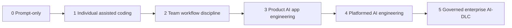

# AI Engineering Maturity Model

Maturity quan trọng vì mỗi team cần mức kiểm soát khác nhau. Một solo prototype và một regulated enterprise agent không nên dùng cùng một quy trình.

Không phải team nào cũng cần Level 5. Maturity đúng là chọn mức kiểm soát tương ứng với rủi ro và quy mô.

## Vì sao maturity quan trọng

Maturity thấp không phải lúc nào cũng xấu. Nó phù hợp cho exploration. Maturity cao không phải lúc nào cũng tốt. Nó có thể trở thành process drag nếu áp cho low-risk work.

Câu hỏi đúng là:

> AI workflow này cần mức repeatability, evidence và control nào?

## Levels

| Level | Tên | Mô tả |
|---|---|---|
| 0 | Prompt-only experimentation | AI use nằm trong ad hoc chats, ít repeatability |
| 1 | Individual assisted coding | Developers dùng Codex/Claude/Cursor-style tools cá nhân |
| 2 | Team workflow discipline | Specs, tests, reviews và shared prompts thành chuẩn team |
| 3 | Product AI app engineering | RAG, tools, evals, observability và CI gates tồn tại |
| 4 | Platformed AI engineering | Shared model routing, tool gateways, policies và templates tồn tại |
| 5 | Governed enterprise AI-DLC | Risk-tiered governance, audit, approvals, SLOs và operations loops tồn tại |

## Capability matrix

| Capability | L0 | L1 | L2 | L3 | L4 | L5 |
|---|---:|---:|---:|---:|---:|---:|
| Shared specs | không | optional | có | có | standardized | governed |
| Coding harness | không | personal | team recommended | integrated | platformed | governed |
| Tests | optional | developer-owned | required | required | policy-driven | audited |
| RAG/data pipeline | không | không | optional | có | reusable platform | governed |
| Tool gateway | không | không | optional | per app | shared | governed |
| Evals | không | không | basic | CI gate | platform service | audit evidence |
| Observability | không | basic logs | CI/test logs | traces | shared telemetry | SLO và incident loop |
| Security governance | informal | personal judgment | team checklist | app controls | platform policy | risk-tiered AI-DLC |

## Lộ trình khuyến nghị theo team type

| Team type | Lộ trình khuyến nghị |
|---|---|
| Solo builder | Level 0 -> Level 1, thêm OpenSpec cho changes lớn |
| Startup product team | Level 1 -> Level 2, thêm Spec Kit/OpenSpec và Superpowers discipline |
| SaaS team build RAG | Level 2 -> Level 3, thêm LangChain, RAG evals, observability |
| Platform engineering team | Level 3 -> Level 4, thêm model router, tool gateway, templates |
| Regulated enterprise | Level 3/4 -> Level 5, thêm AWS AI-DLC-style gates và audit |

## Dấu hiệu over-engineering

- Mỗi typo fix đều cần AI-DLC flow dài.
- Team viết specs nhưng không ai đọc.
- Evals tồn tại nhưng không đại diện user failures.
- Model routing tồn tại trước khi có nhiều model policies thật.
- Tool gateway tồn tại nhưng chỉ có một read-only tool an toàn.
- Developers bypass process vì process không tạo evidence hữu ích.

## Dấu hiệu under-engineering

- Agents sửa code quan trọng mà không có tests.
- RAG answers được tin mà không có retrieval evals.
- Tool calls không được log.
- Sensitive data đi vào prompts mà không classification.
- Không ai giải thích được model nào xử lý production incident.
- Approval diễn ra trong chat và không có durable audit record.

## Upgrade sequence

1. Standardize specs và test discipline trước.
2. Thêm traces trước khi scale AI apps.
3. Thêm evals trước khi đổi models/retrievers/prompts thường xuyên.
4. Thêm tool gateway trước write-capable production tools.
5. Thêm AI-DLC governance khi work high-risk hoặc nhiều stakeholder.
