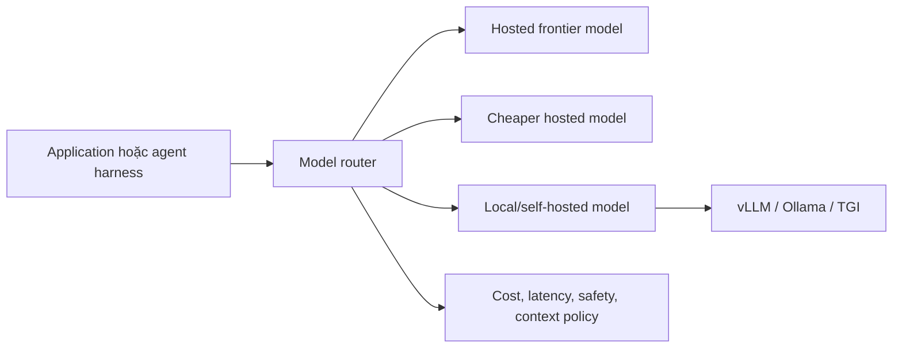

# Tầng model và serving

Tầng model và serving quyết định model nào chạy inference, chạy ở đâu, request được route như thế nào và toàn bộ stack phía trên phải sống trong giới hạn vận hành nào.

Model layer không phải workflow framework. Nó quyết định năng lực suy luận, chi phí, độ trễ, context window, khả năng tool-calling và boundary dữ liệu.

## Layer này sở hữu điều gì

| Mối quan tâm | Vì sao quan trọng |
|---|---|
| Model capability | Coding, planning, extraction, classification, tool calling, chất lượng đa ngôn ngữ |
| Context window | Agent có đủ chứa specs, logs, retrieved context và diffs không |
| Latency | Product có cảm giác interactive hay batch-oriented |
| Cost | Hệ thống có scale được sau demo không |
| Data boundary | Prompt và output có được rời khỏi môi trường kiểm soát không |
| Availability | Khi provider lỗi thì có fallback model hoặc queue không |
| Serving operations | Team có phải quản lý GPU capacity, scaling, upgrades và monitoring không |

## Provider-hosted vs self-hosted

| Option | Hợp nhất khi | Tradeoff |
|---|---|---|
| Hosted frontier model | reasoning khó, coding, multimodal, tool use | cost, latency, data boundary concerns |
| Hosted smaller model | classification, extraction, simple routing | reasoning yếu hơn |
| Local/self-hosted model | data control, offline, cost predictability | ops burden, capability thường yếu hơn frontier |
| Model router | tối ưu mixed workload | cần policy và observability |

Hosted models thường là cách nhanh nhất để có capability cao. Self-hosted models hợp khi data boundary, workload lớn có thể dự đoán, offline operation hoặc platform control quan trọng hơn maximum frontier capability.

## Model router pattern

Model router hữu ích khi mỗi loại task cần model khác nhau:

| Task | Routing choice tốt |
|---|---|
| Architecture reasoning | strongest reasoning model |
| Code generation | strong coding model |
| Classification | cheaper fast model |
| Embedding | embedding-specific model |
| Summarization dữ liệu nhạy cảm | local hoặc private model |
| Bulk extraction | cheaper model có structured-output checks |

Router không nên chỉ là một switch statement. Nó phải log quyết định, enforce data policy, track cost và cho phép evaluate từng route.

## Local LLM pattern

Local models có giá trị khi:

1. Dữ liệu không được rời khỏi môi trường kiểm soát.
2. Workload đủ lặp lại để justify infrastructure.
3. Task không cần frontier-level reasoning.
4. Team vận hành được GPU, model updates, quantization và serving metrics.

Local serving không tự động rẻ hơn. Cần tính GPU utilization, maintenance, latency tuning, evaluation và incident response.

## Decision matrix

| Constraint | Nên ưu tiên |
|---|---|
| Chất lượng reasoning cao nhất | Hosted frontier model |
| Data boundary nghiêm ngặt | Local/self-hosted hoặc private managed deployment |
| Nhiều call đơn giản volume cao | Smaller hosted model hoặc local batch serving |
| Nhiều team với use case khác nhau | LiteLLM-style gateway/router |
| Cần offline operation | Local/self-hosted |
| Cần thử nghiệm nhanh | Hosted model trước |
| Enterprise regulated deployment | Router có audit, retention và approval policy |

## Hướng dẫn adoption step-by-step

1. Liệt kê workloads: coding, support, RAG answering, extraction, classification, summarization, embeddings.
2. Gắn risk cho từng workload: public, internal, confidential, regulated.
3. Định nghĩa capability cần có: context length, tool calling, structured output, multilingual support, latency.
4. Bắt đầu với một hosted model cho path khó nhất và một cheaper model cho path đơn giản.
5. Chỉ thêm model router khi đã có ít nhất hai routing policy thật.
6. Chỉ thêm self-hosted serving sau khi evals chứng minh local model đủ tốt.
7. Log route, model, token count, latency, failure và cost cho mọi call.
8. Thêm fallback policy cho outage, rate limit và quality regression.

## Failure modes

| Failure mode | Hậu quả | Cách tránh |
|---|---|---|
| Chọn model yếu cho coding phức tạp | Agent trông như thiếu discipline nhưng thật ra model underpowered | Capability evals trước rollout |
| Không có routing policy | Expensive models xử lý cả task trivial | Cost-aware routing |
| Không data classification | Prompt confidential đi sai provider | Data boundary policy |
| Self-host quá sớm | Platform team biến thành GPU operations team | Chứng minh bằng cost và data analysis |
| Không fallback | Provider outage thành product outage | Fallback và queue policy |
| Không telemetry | Cost và latency problems vô hình | Observability per model route |

## References

- [LiteLLM docs](https://docs.litellm.ai/)
- [vLLM docs](https://docs.vllm.ai/)
- [Ollama GitHub](https://github.com/ollama/ollama)
- [LangChain model integrations](https://docs.langchain.com/oss/python/langchain/overview)
- [Hermes Agent](https://github.com/NousResearch/hermes-agent)
