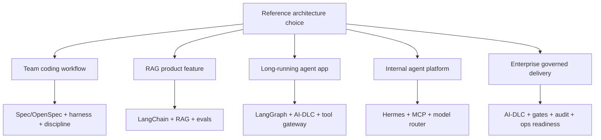

# Reference Architectures

Reference architectures cho thấy các layer kết hợp như thế nào trong hệ thống thật. Đây không phải product template. Đây là decision map: layer nào sở hữu trách nhiệm nào, framework nào nên lead và team thường overbuild ở đâu.

## Architecture map



## Architecture 1: AI-assisted product engineering team

Stack khuyến nghị:

```text
Spec Kit or OpenSpec + Codex/Claude/Hermes + Superpowers-style TDD + CI
```

| Layer | Lựa chọn | Lý do |
|---|---|---|
| Workflow | Spec Kit cho feature lớn, OpenSpec cho lightweight changes | giữ intent và implementation aligned |
| Harness | Codex CLI, Claude Code hoặc Hermes | thực hiện coding, terminal, repo operations |
| Discipline | Superpowers-style TDD/review | ngăn agent code mà không có tests |
| Verification | CI tests và PR review | biến AI output thành engineering evidence bình thường |

Dùng khi vấn đề chính là software delivery quality, không phải build production AI application.

Step-by-step:

1. Định nghĩa khi nào change cần Spec Kit vs OpenSpec.
2. Định nghĩa spec template tối thiểu với goals, non-goals, acceptance criteria và risks.
3. Bắt buộc TDD hoặc test-first prompts cho behavior changes.
4. Chỉ dùng harness để implement sau khi spec/change artifact được review.
5. Bắt buộc CI và human PR review trước merge.

## Architecture 2: Production RAG product feature

Stack khuyến nghị:

```text
OpenSpec + LangChain + Data/RAG layer + evals/observability + CI eval gate
```

| Layer | Lựa chọn | Lý do |
|---|---|---|
| Change control | OpenSpec | proposal và spec delta nhẹ |
| AI app framework | LangChain | orchestration nhanh cho RAG và tools |
| Data layer | ingestion, parsing, chunking, vector/hybrid search | RAG quality phụ thuộc data pipeline |
| Observability | LangSmith, Langfuse, Phoenix | traces và evals cho retrieval/generation |
| CI gate | retrieval và answer evals | ngăn prompt/retriever/model regressions |

Dùng cho chatbots, support assistants, documentation assistants hoặc knowledge search features.

Step-by-step:

1. Định nghĩa allowed sources và data owners.
2. Tạo golden dataset gồm user questions và expected evidence.
3. Build RAG pipeline hẹp trước.
4. Thêm citations và refusal behavior.
5. Thêm traces và evals trước broad rollout.
6. Thêm permission-aware retrieval trước khi dùng sensitive data.

## Architecture 3: Long-running agent service

Stack khuyến nghị:

```text
AI-DLC + LangGraph + tool gateway + evals + audit logs
```

| Layer | Lựa chọn | Lý do |
|---|---|---|
| Delivery governance | AWS AI-DLC | risk, approval, NFR, audit |
| Runtime app framework | LangGraph | stateful graph, human-in-the-loop, long-running execution |
| Tools | Tool gateway/MCP/OpenAPI | external actions có kiểm soát |
| Evaluation | node evals và trajectory evals | verify state transitions và actions |
| Observability | traces và audit logs | production debugging và accountability |

Dùng khi AI system thực hiện multi-step work theo thời gian, cần memory/state hoặc có thể trigger external actions.

Step-by-step:

1. Chạy AI-DLC inception cho risk, stakeholders, NFR và approval model.
2. Thiết kế LangGraph state và node boundaries.
3. Classify tools và actions theo risk.
4. Gate write/destructive actions.
5. Thêm node-level tests và full trajectory evals.
6. Thêm traces, audit logs và rollback/runbook procedures.

## Architecture 4: Internal agent platform with custom harness

Stack khuyến nghị:

```text
Hermes + model router + MCP/tool gateway + OpenSpec + Superpowers-like skills
```

| Layer | Lựa chọn | Lý do |
|---|---|---|
| Harness/runtime | Hermes | open/customizable agent runtime |
| Model layer | model router | kiểm soát hosted và local models |
| Tool layer | MCP/tool gateway | standardized tool access và policy |
| Workflow | OpenSpec | lightweight change artifacts |
| Discipline | Superpowers-like skills | TDD, review, debugging, planning behavior |

Dùng khi muốn sở hữu agent harness thay vì chỉ phụ thuộc managed coding CLIs.

Step-by-step:

1. Định nghĩa vì sao Codex/Claude-style CLIs chưa đủ.
2. Chọn model routes theo workload và data boundary.
3. Thêm MCP/tool gateway trước khi expose internal systems.
4. Pilot một repo với OpenSpec và tool set giới hạn.
5. Thêm skills cho planning, TDD, review và debugging.
6. Log tool calls và đo xem custom harness có cải thiện outcome không.

## Architecture 5: Enterprise AI-DLC delivery system

Stack khuyến nghị:

```text
AWS AI-DLC + Spec Kit/OpenSpec patterns + security governance + release readiness + observability
```

| Layer | Lựa chọn | Lý do |
|---|---|---|
| Lifecycle | AWS AI-DLC | govern AI-driven delivery |
| Requirements | Spec Kit/OpenSpec concepts | acceptance criteria và change deltas rõ hơn |
| Security | risk-tiered gates | ngăn speed vượt accountability |
| Operations | release readiness và runbooks | lấp khoảng trống giữa construction và production |
| Observability | traces, CI, incident feedback | evidence cho production behavior |

Dùng khi nhiều stakeholders, high-risk systems, regulated domains hoặc platform teams cần repeatable delivery governance.

Step-by-step:

1. Định nghĩa risk tiers.
2. Định nghĩa approval owners cho product, architecture, security, operations.
3. Định nghĩa required artifacts theo tier.
4. Dùng Spec Kit/OpenSpec patterns bên trong AI-DLC artifacts để tăng clarity.
5. Thêm construction verification: tests, evals, security checks.
6. Thêm operations verification: rollout, rollback, monitoring, incident feedback.

## Cách chọn reference architecture

| Vấn đề chính | Chọn |
|---|---|
| Team muốn AI-assisted coding tốt hơn | Architecture 1 |
| Product cần RAG hoặc knowledge assistant | Architecture 2 |
| Product cần stateful autonomous workflow | Architecture 3 |
| Platform team muốn custom open agent runtime | Architecture 4 |
| Enterprise cần audit, approvals, NFR, governance | Architecture 5 |

## Quy tắc kết hợp

Bắt đầu với một owner cho mỗi layer. Đừng kết hợp hai framework cùng claim một artifact trừ khi đã định nghĩa precedence rõ.

Ví dụ:

| Artifact | Owner |
|---|---|
| Requirement spec | Spec Kit hoặc OpenSpec, không dùng cả hai cho cùng feature |
| Lifecycle approval | AI-DLC |
| Agent execution | Codex/Claude/Hermes |
| AI app runtime | LangChain hoặc LangGraph |
| Tool permissions | Tool gateway |
| Production proof | Evals và observability |
