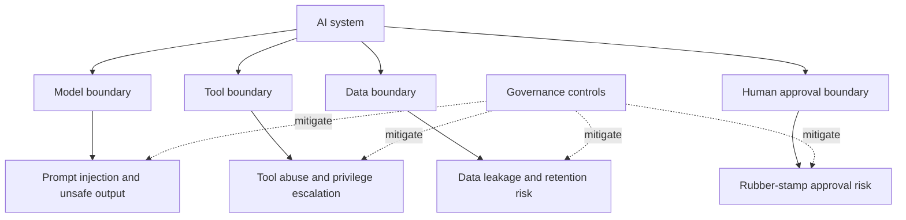

# Security và Governance

Security và governance định nghĩa AI system được phép biết gì, nói gì, thay đổi gì, lưu gì và kích hoạt gì. Layer này cắt ngang workflow frameworks, harnesses, app frameworks, tools, data và models.

Governance không có nghĩa là làm chậm mọi thứ. Governance đúng nghĩa là tăng ceremony theo risk tier.

## Layer này sở hữu điều gì

| Mối quan tâm | Control ví dụ |
|---|---|
| Data boundary | classification, redaction, retention |
| Tool boundary | scoped credentials, allowlists, approval gates |
| Model boundary | provider policy, model routing, sensitive-data controls |
| Human boundary | named approvers, review evidence, escalation |
| Delivery boundary | risk-tiered AI-DLC gates, PR checks, release readiness |
| Audit boundary | traces, decision records, tool-call logs |
| Memory boundary | lưu gì, ở đâu, bao lâu và xóa như thế nào |

## AI agent threat model

## Control map

| Risk | Control |
|---|---|
| Prompt injection | instruction hierarchy, retrieval filtering, tool confirmation |
| Data exfiltration | data classification, redaction, allowlisted tools |
| Tool abuse | scoped credentials, human approval cho destructive actions |
| Memory leakage | retention policy, deletion policy, workspace isolation |
| Unreviewed AI code | PR review, tests, CI, AI-DLC audit cho high-risk changes |
| Rubber-stamp governance | named approvers và evidence-based approval |

## Governance theo risk tier

| Risk tier | Ví dụ | Control bắt buộc |
|---|---|---|
| Low | UI copy, docs, small refactor | review và tests bình thường |
| Medium | product behavior, billing UX, data processing | spec/change artifact, tests, reviewer evidence |
| High | auth, payments, customer data, infrastructure | AI-DLC-style gates, security review, audit record |
| Critical | regulated data, destructive automation, prod deploys | named approvers, rollback plan, incident readiness, tool-call audit |

Đây là nơi AWS AI-DLC mạnh nhất: nó làm lifecycle state, approvals và audit trở thành explicit. Spec Kit và OpenSpec có thể định nghĩa changes, nhưng governance phải được bổ sung khi risk cao.

## Security checklist cho coding agents

- Dùng isolated workspaces hoặc worktrees cho risky changes.
- Không cấp unrestricted production credentials cho coding agent.
- Bắt buộc tests trước khi merge.
- Review generated specs và generated code riêng biệt.
- Log shell commands và tool calls khi có thể.
- Cần human approval cho destructive filesystem hoặc cloud actions.
- Chỉ lưu prompts và generated docs trong approved repo locations.
- Xem generated code như code của junior developer cho đến khi review.

## Security checklist cho AI apps

- Classify data trước khi vào prompts, retrieval, memory hoặc logs.
- Filter retrieval results trước khi dựng model context.
- Scope tool credentials theo least privilege.
- Gate write/destructive actions.
- Thêm prompt-injection tests cho tool và RAG workflows.
- Thêm output validation cho structured actions.
- Track model, prompt version, tool version và trace ID.
- Định nghĩa memory retention và deletion policy.
- Có incident runbooks cho unsafe outputs và tool misuse.

## Hướng dẫn adoption step-by-step

1. Định nghĩa risk tiers cho tổ chức.
2. Map mỗi AI workflow hoặc app feature vào một risk tier.
3. Định nghĩa evidence bắt buộc theo tier: spec, tests, evals, approval, audit, rollback.
4. Xác định tất cả data classes agent/app chạm tới.
5. Xác định tất cả tools và đánh dấu read, write, destructive hoặc sensitive.
6. Thêm approval gates cho high-risk actions.
7. Thêm logs và traces trước production rollout.
8. Review controls sau incidents và major model/tool changes.

## Failure modes

| Failure mode | Hậu quả | Cách tránh |
|---|---|---|
| Governance áp như nhau cho mọi thứ | team bypass process | ceremony theo risk tier |
| Không named approvers | approval mơ hồ | explicit ownership |
| Bỏ qua prompt injection | retrieved content điều khiển tools | safety evals và tool confirmation |
| Secrets trong prompts/logs | data breach | redaction và secret scanning |
| Memory giữ mãi | privacy và compliance risk | retention và deletion policy |
| Agent có broad credentials | privilege escalation | scoped credentials và gateway |

## References

- [AWS AI-DLC Workflows](https://github.com/awslabs/aidlc-workflows)
- [Model Context Protocol](https://modelcontextprotocol.io/)
- [OpenTelemetry](https://opentelemetry.io/)
- [Langfuse docs](https://langfuse.com/docs)
- [Arize Phoenix docs](https://docs.arize.com/phoenix)
