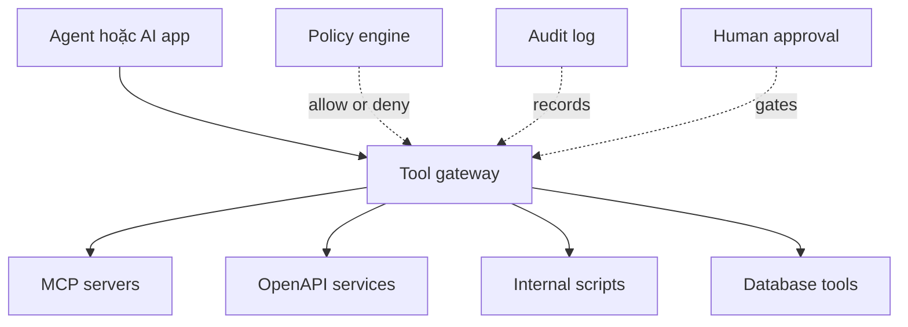

# Tools, MCP và Gateway

Tầng tools định nghĩa AI app hoặc agent được phép làm gì bên ngoài model. Nó bao gồm gọi API, đọc file, query database, mở ticket, sửa code, gửi email và gọi internal systems.

Đây là nơi capability biến thành risk. Một model chỉ trả lời text thì bị giới hạn. Một model gọi được tools tạo ra giá trị lớn hơn, nhưng cần authorization, policy, audit và rollback boundaries.

MCP không thay thế LangChain, LangGraph, Hermes hay AI-DLC. MCP là protocol/tool integration layer. Các framework khác có thể sử dụng MCP.

## Layer này sở hữu điều gì

| Mối quan tâm | Kiểm soát điều gì |
|---|---|
| Tool schema | Model được sinh arguments nào |
| Tool discovery | Tool nào visible với agent/user nào |
| Authentication | Identity nào được dùng để gọi tool |
| Authorization | Action được request có được phép không |
| Approval | Có cần human confirmation không |
| Rate limit | Tool usage được phép đến mức nào |
| Audit | Tool nào được gọi, bởi ai, input gì, vì sao |
| Isolation | Tool có thể ảnh hưởng local files, prod systems hoặc sensitive data không |

## Function calling vs MCP vs OpenAPI tools

| Mechanism | Ý nghĩa |
|---|---|
| Function calling | Model sinh structured tool arguments |
| OpenAPI tool | Tool schema đến từ HTTP API contract |
| MCP | Standard protocol để expose tools/resources/prompts cho agents |
| Tool gateway | Boundary do tổ chức kiểm soát cho policy, auth, rate limit và audit |

Function calling là hình dạng ở phía model. MCP là protocol để expose tool và context surfaces cho AI apps. OpenAPI là cách phổ biến để mô tả HTTP services có sẵn. Tool gateway là enterprise control plane khi nhiều agents và nhiều tools cần policy nhất quán.

## Tool gateway pattern

Gateway hữu ích khi cần một nơi enforce:

1. Tool nào available cho agent nào.
2. Action nào cần approval.
3. Data class nào được gửi đến tool nào.
4. Call nào phải log.
5. Credentials và scopes nào được dùng.
6. Tool nào read-only, write-capable hoặc destructive.

## Permission và approval model

| Action class | Ví dụ | Control |
|---|---|---|
| Read-only low risk | search docs, read public metadata | allow với logging |
| Read-only sensitive | read customer record, inspect incident logs | chỉ allow bằng scoped identity |
| Write low risk | create draft ticket, update local branch | allow với trace |
| Write medium risk | update issue status, create pull request | approval hoặc review gate |
| Destructive/high risk | delete resource, rotate secrets, deploy prod | explicit human approval và break-glass policy |

Default đúng không phải là "agent không được dùng tools." Default đúng là "tools được scope theo risk."

## Tool safety checklist

- Mỗi tool có name rõ và description hẹp chưa?
- Arguments có typed và validated không?
- Tool có read-only by default không?
- Credential đã scope minimum permission chưa?
- User identity có được propagate khi cần không?
- Destructive actions có bị block hoặc approval-gated không?
- Tool inputs/outputs có được log và redact sensitive fields không?
- Prompt có bị chặn việc tự bịa quyền tool không?
- Retry có idempotent không?
- Write actions có rollback hoặc compensation path không?

## Hướng dẫn adoption step-by-step

1. Inventory tools agent cần: filesystem, shell, Git, issue tracker, CRM, database, cloud APIs.
2. Classify từng tool: read-only, write, destructive hoặc sensitive.
3. Bắt đầu với read-only tools và local development tools.
4. Bọc tool calls sau gateway hoặc policy layer trước khi expose production systems.
5. Thêm approval gates cho write và destructive actions.
6. Log tool call intent, arguments, actor, result và trace ID.
7. Thêm eval cases cho unsafe tool requests.
8. Review tool access trong mỗi rollout agent capability mới.

## Failure modes

| Failure mode | Dấu hiệu | Cách làm tốt hơn |
|---|---|---|
| Broad shell access trong production | agent có thể mutate systems ngoài ý muốn | tách dev harness tools khỏi prod app tools |
| Tool descriptions mơ hồ | model gọi sai tool | narrow schemas và examples |
| Không approval cho writes | tạo ticket/email/deploy nhầm | approval theo risk tier |
| Tool output leak secrets | logs hoặc prompts chứa sensitive data | redaction và data classification |
| Xem MCP là governance | có protocol nhưng không policy | thêm gateway, RBAC, audit và approval |
| Không audit log | không thể điều tra incident | trace mọi tool call |

## References

- [Model Context Protocol](https://modelcontextprotocol.io/)
- [OpenTelemetry](https://opentelemetry.io/)
- [Hermes Agent](https://github.com/NousResearch/hermes-agent)
- [LangChain overview](https://docs.langchain.com/oss/python/langchain/overview)
- [LangGraph overview](https://docs.langchain.com/oss/python/langgraph/overview)
