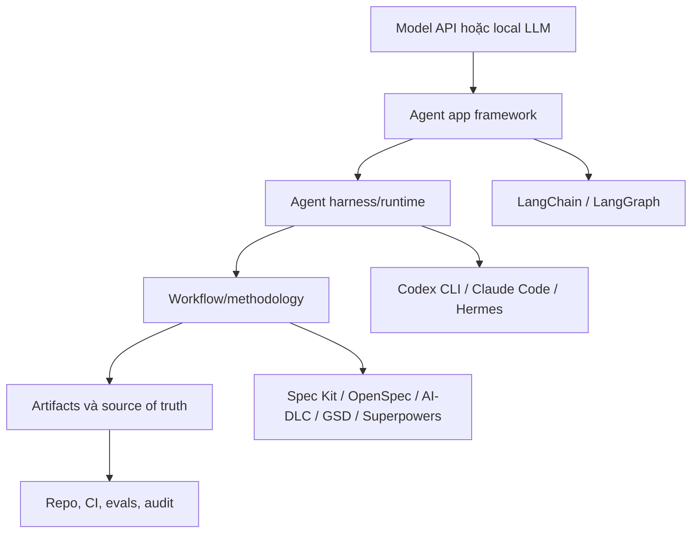
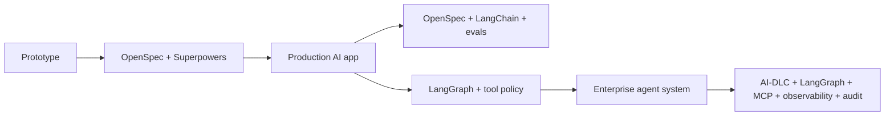

# Cheat Sheet Một Trang

Dùng trang này khi bạn cần trả lời thật nhanh: **tool nào nằm ở layer nào, và nó phải tạo ra artifact gì?**

## Mô hình 30 giây

Ý chính:

> Nhiều framework dùng cùng các từ như plan, implement, review. Chúng khác nhau ở chỗ **chúng govern cái gì**.

## Chọn theo vấn đề

| Vấn đề thật sự | Nên bắt đầu với | Vì sao |
|---|---|---|
| Agent hay đoán requirement | GitHub Spec Kit | Biến intent, spec, plan, tasks thành rõ ràng trước khi code |
| Muốn SDD nhẹ | OpenSpec | Có change proposal và delta spec nhưng ít ceremony |
| Cần traceability enterprise | AWS AI-DLC Workflows | Có approval, risk record, NFR và audit trail |
| Công việc kéo dài nhiều session | GSD | Giữ context, phase plan và handoff |
| Agent code thiếu discipline | Superpowers | Ép design, TDD, review và finish |
| Build RAG hoặc tool-calling app | LangChain | Compose model, prompt, tool, retriever và chain |
| Build stateful agent service | LangGraph | Mô hình hóa state, node, edge, checkpoint và human-in-the-loop |
| Cần agent runtime tự customize | Hermes | Sở hữu harness, tools, memory, skills và model routing |
| Cần protocol cho tools | MCP | Chuẩn hóa cách expose tools và boundary tích hợp |

## Cùng từ, khác quyền sở hữu

| Từ | Trong workflow framework | Trong harness/runtime | Trong app framework |
|---|---|---|---|
| Plan | Delivery plan, spec, tasks, approval path | Agent execution plan để dùng tools | Thiết kế graph, chain, node hoặc state transition |
| Implement | Code theo requirements | Tool calls, file edits, terminal actions | Runtime logic bên trong AI app |
| Review | Human/code/spec review | Kiểm tra output của agent | Eval, trace hoặc behavior inspection |
| Memory | Project context hoặc handoff dài hạn | Agent memory/session context | App memory, state hoặc retrieval |
| Governance | Delivery gates và accountability | Tool permissions và sandboxing | Runtime guardrails và eval thresholds |

## Ma trận chọn nhanh

| Bối cảnh | Workflow chính | Layer hỗ trợ | Artifact tối thiểu |
|---|---|---|---|
| Feature nhỏ trong product | Spec Kit hoặc OpenSpec | Superpowers | spec/change proposal, tasks, tests |
| Startup MVP | OpenSpec | Superpowers, LangChain nếu là AI app | change proposal, test checklist, done criteria |
| Enterprise modernization | AWS AI-DLC | Spec Kit, Superpowers | risk record, NFRs, approval log, migration plan |
| RAG product | OpenSpec | LangChain, evals, observability | data contract, eval set, prompt contract |
| Long-running agent service | AI-DLC hoặc OpenSpec | LangGraph, security/governance | state schema, tool policy, eval gates |
| Internal agent platform | AI-DLC | Hermes, MCP, LangGraph, observability | tool registry, memory policy, audit trail |
| Dự án delivery multi-agent | GSD | Superpowers, Spec Kit/OpenSpec | phase plan, context packet, handoff notes |

## Không nên so sánh trực tiếp

| So sánh sai | Cách hiểu đúng hơn |
|---|---|
| LangGraph vs AI-DLC | LangGraph build runtime behavior; AI-DLC govern delivery |
| Hermes vs Spec Kit | Hermes chạy agent; Spec Kit cấu trúc spec |
| MCP vs LangChain | MCP expose tools; LangChain build app logic có thể dùng tools |
| Superpowers vs Codex CLI | Superpowers là engineering method; Codex CLI là agent harness |
| OpenSpec vs LangGraph | OpenSpec govern change; LangGraph implement stateful agent behavior |

## Stack tối thiểu theo maturity

## Nguyên tắc thực dụng

Chỉ chọn **một primary workflow** làm source of truth. Sau đó thêm app framework, harness, tools và eval layer xung quanh, nhưng đừng để mỗi layer tự tạo một plan riêng.
