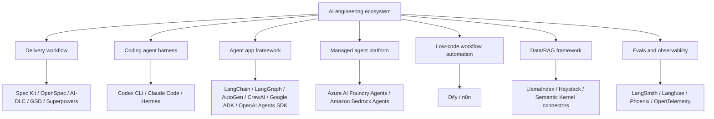

# Bản Đồ Ecosystem Agent Lân Cận

Guide này tập trung vào AI engineering workflows, harnesses và app frameworks. Ecosystem rộng hơn còn có agent SDKs, managed agent services, low-code automation, data frameworks và observability platforms.

Mục tiêu của trang này là tránh nhầm category.

## Ecosystem theo layer

## Định nghĩa category

| Category | Câu hỏi chính | Ví dụ | Output |
|---|---|---|---|
| Delivery workflow/methodology | Humans và agents nên deliver software như thế nào? | Spec Kit, OpenSpec, AI-DLC, GSD, Superpowers | specs, plans, tasks, reviews, approvals |
| Coding agent harness/runtime | AI coding agent chạy với tools, memory, files, shell và policies như thế nào? | Codex CLI, Claude Code, Hermes | tool calls, code changes, session memory |
| Agent app framework | Build AI app hoặc agent service như thế nào? | LangChain, LangGraph, OpenAI Agents SDK, AutoGen, CrewAI, Google ADK | chains, graphs, agents, state, tool calls |
| Managed agent platform | Host/manage enterprise agents bằng provider service như thế nào? | Azure AI Foundry Agent Service, Amazon Bedrock Agents | managed agents, connectors, deployment controls |
| Low-code AI workflow | Team không chuyên code compose AI workflow nhanh thế nào? | Dify, n8n | workflow canvas, nodes, app templates |
| Data/RAG framework | Ingest, index, retrieve và ground knowledge như thế nào? | LlamaIndex, Haystack | indexes, retrievers, document pipelines |
| Evals/observability | Làm sao biết behavior đúng trong production? | LangSmith, Langfuse, Phoenix, OpenTelemetry | traces, metrics, eval scores, alerts |

## Các tool lân cận liên quan thế nào

| Tool | Mental model đúng | Có thể cạnh tranh với | Không thay thế |
|---|---|---|---|
| OpenAI Agents SDK | App-level agent SDK cho tool-using agents | Một số app frameworks/SDKs | AI-DLC, Spec Kit, OpenSpec, release governance |
| AutoGen | Multi-agent programming framework | CrewAI, LangGraph trong vài workload multi-agent | Delivery workflow, source-of-truth artifacts |
| CrewAI | Role/task oriented multi-agent framework | AutoGen, LangGraph trong vài workload | Governance, evals, tool policy |
| Google ADK | Agent development kit để build/deploy agents | Các agent app SDK khác | SDD, AI-DLC, coding harness |
| Azure AI Foundry Agent Service | Managed enterprise agent service | Managed agent platforms khác | Repo-level delivery workflow |
| Amazon Bedrock Agents | Managed AWS agent capability | Managed agent platforms khác | Spec discipline hoặc AI-DLC decisions |
| Dify | Low-code LLM app/agent workflow platform | n8n, một số app framework use cases | Deep codebase workflow governance |
| n8n AI Agent | Workflow automation với AI agent nodes | Dify, automation platforms | Spec, tests, code review discipline |
| LlamaIndex | Data/RAG-focused framework | LangChain cho data-heavy RAG flows | Delivery workflow hoặc agent harness |
| Semantic Kernel | App orchestration SDK có enterprise integration patterns | LangChain/OpenAI SDK trong vài bối cảnh | AI-DLC governance |

## Khi nào nên thêm deep dive

Không nên thêm deep dive cho mọi AI tool đang nổi. Chỉ thêm deep dive khi một điều kiện sau đúng:

| Tín hiệu | Có nên thêm page? | Vì sao |
|---|---|---|
| Người đọc hay nhầm nó với SDD/workflow framework | Có | Giảm confusion khi ra quyết định |
| Nó thay đổi source-of-truth artifacts | Có | Ảnh hưởng delivery method |
| Nó chỉ là implementation library | Có thể | Nên nhắc trong ecosystem map trước |
| Nó là provider-managed và enterprise-specific | Có thể | Thêm platform page nếu cần deployment guidance |
| Nó low-code và audience là non-developer | Có thể | Chỉ thêm nếu guide hướng đến citizen developers |

## Ví dụ chọn thực tế

| Tình huống | Combination khuyến nghị |
|---|---|
| Build custom RAG backend bằng code | OpenSpec + LangChain hoặc LlamaIndex + evals |
| Build stateful support agent | AI-DLC hoặc OpenSpec + LangGraph + tool policy |
| Build multi-agent research prototype | OpenSpec + AutoGen hoặc CrewAI + Superpowers |
| Build enterprise agent trên Azure | AI-DLC + Azure AI Foundry Agent Service + eval/audit gates |
| Build enterprise agent trên AWS | AI-DLC + Amazon Bedrock Agents + eval/audit gates |
| Build internal automation bằng low code | OpenSpec-lite + n8n hoặc Dify + tool permission matrix |
| Build coding/research agent harness riêng | Hermes + Superpowers + tool permission matrix |

## Official references

- OpenAI Agents SDK: https://platform.openai.com/docs/guides/agents-sdk/
- Microsoft AutoGen: https://microsoft.github.io/autogen/
- CrewAI: https://docs.crewai.com/
- Google Agent Development Kit: https://google.github.io/adk-docs/
- Azure AI Foundry Agent Service: https://learn.microsoft.com/azure/ai-foundry/agents/overview
- Amazon Bedrock Agents: https://docs.aws.amazon.com/bedrock/latest/userguide/agents.html
- Dify: https://docs.dify.ai/
- n8n AI Agent node: https://docs.n8n.io/integrations/builtin/cluster-nodes/root-nodes/n8n-nodes-langchain.agent/
- LlamaIndex: https://docs.llamaindex.ai/
- Haystack: https://docs.haystack.deepset.ai/
- Semantic Kernel: https://learn.microsoft.com/semantic-kernel/

## Kết luận ngắn

Nếu tool build **runtime behavior**, nó thuộc app/platform layer. Nếu tool govern **cách code changes được specify, approve, implement và review**, nó thuộc workflow layer. Team tốt thường cần cả hai, nhưng không nên nhầm hai thứ này là cùng một loại.
