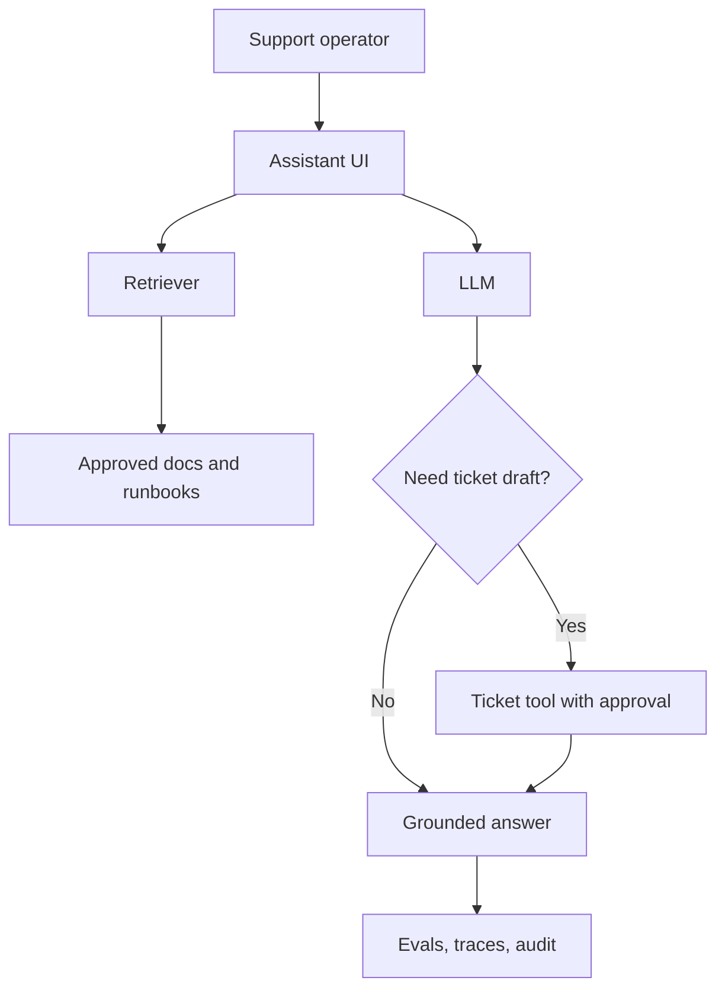
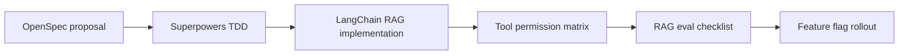
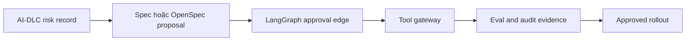

# Scenario Lab: Một Feature, Nhiều Workflow

Trang này làm rõ sự khác biệt bằng cách áp dụng từng workflow vào cùng một scenario sản phẩm.

## Scenario

Build một **RAG support assistant** cho đội vận hành nội bộ của một SaaS.

Assistant phải:

- trả lời từ product docs và runbooks đã được duyệt;
- cite sources;
- refuse khi câu trả lời không grounded;
- tùy chọn tạo draft incident ticket;
- log traces và eval results;
- rollout an toàn sau feature flag.

## Kiến trúc runtime giống nhau

Runtime architecture không thay đổi quá nhiều giữa các workflow. Điều thay đổi là **source of truth** và **control surface**.

| Layer | Gợi ý chọn | Vì sao |
|---|---|---|
| App framework | LangChain | RAG composition nhanh, tích hợp retriever/tool |
| Stateful orchestration | LangGraph nếu ticket workflow thành multi-step | Có state, checkpoint, approval edge |
| Tool protocol | MCP hoặc explicit tool gateway | Giữ ticket tool permissions có audit |
| Workflow | Tùy scenario bên dưới | Control requirements, risk và delivery |
| Evals | Golden Q&A set + grounding checks | Ngăn hallucinated support answers |
| Observability | Trace retrieval, model call và tool proposal | Debug quality và support audit |

## Path 1: GitHub Spec Kit

Dùng Spec Kit khi rủi ro chính là requirement mơ hồ.

### Step-by-step

1. Viết feature spec: users, scope, data sources, refusal behavior, citation rules.
2. Tạo implementation plan: UI, retrieval, prompt contract, ticket tool, evals.
3. Chia plan thành tasks: ingestion, retriever, prompt, tool policy, tests, docs.
4. Implement chỉ theo accepted spec.
5. Review requirement nào đã có test hoặc eval evidence.

### Artifacts

| Artifact | Ví dụ nội dung |
|---|---|
| `spec.md` | "Assistant SHALL cite approved runbook source for each operational answer." |
| `plan.md` | RAG architecture, model choice, retrieval strategy, rollout |
| `tasks.md` | Task list map về requirements |
| eval report | Grounded answer rate, refusal correctness, source coverage |

### Hợp nhất khi

Product team có business/product ambiguity là nguồn lỗi lớn nhất của agent.

## Path 2: OpenSpec

Dùng OpenSpec khi change có scope rõ và bạn muốn spec discipline nhẹ.

### Step-by-step

1. Tạo change proposal như `add-support-rag-assistant`.
2. Thêm delta specs cho capabilities mới: grounded answer, source citation, ticket draft.
3. Định nghĩa scenarios bằng `Given / When / Then`.
4. Implement minimal change.
5. Validate change và archive proposal sau khi adopted.

### Artifacts

| Artifact | Ví dụ nội dung |
|---|---|
| change proposal | Vì sao cần assistant và change gì |
| delta spec | Requirements cho support assistant capability |
| validation notes | Test/eval evidence và rollout status |

### Hợp nhất khi

Small-to-mid team muốn lợi ích SDD nhưng không cần enterprise governance.

## Path 3: AWS AI-DLC Workflows

Dùng AI-DLC khi assistant có thể ảnh hưởng khách hàng, operations, regulated data hoặc high-risk decisions.

### Step-by-step

1. Classify AI behavior: user-facing, tool-using, data-sensitive, operational impact.
2. Tạo risk register và required approvals.
3. Định nghĩa NFRs: latency, data retention, auditability, availability, safety.
4. Bắt buộc security review cho document permissions và ticket tool side effects.
5. Định nghĩa eval gates và deployment evidence.
6. Release sau feature flag với monitoring và rollback plan.

### Artifacts

| Artifact | Ví dụ nội dung |
|---|---|
| risk register | Hallucinated runbook step, unauthorized ticket creation, stale docs |
| approval record | Product, security, platform, operations |
| NFR checklist | Latency, retention, availability, traceability |
| audit evidence | Eval run, traces, approval decisions, deployment record |

### Hợp nhất khi

Enterprise team nơi chi phí của một AI action sai là cao.

## Path 4: GSD

Dùng GSD khi công việc dài ngày, multi-agent hoặc dễ mất context qua nhiều session.

### Step-by-step

1. Tạo mission và phase plan.
2. Build context packet: repo map, data sources, support flows hiện có, constraints.
3. Chia phases: discovery, ingestion, retriever, prompt/tool, eval, rollout.
4. Sau mỗi session, update handoff notes với decisions và remaining risks.
5. Dùng context packet để resume mà không phải khám phá lại project.

### Artifacts

| Artifact | Ví dụ nội dung |
|---|---|
| phase plan | Discovery -> RAG implementation -> eval -> rollout |
| context packet | Repo structure, docs inventory, tool API notes |
| handoff notes | Đã đổi gì, fail gì, tiếp theo làm gì |

### Hợp nhất khi

Delivery dài ngày cần continuity hơn là formal approval gates.

## Path 5: Superpowers

Dùng Superpowers khi agent cần engineering discipline mạnh hơn.

### Step-by-step

1. Brainstorm edge cases trước khi implement.
2. Viết design note cho retrieval, prompting, ticket tool policy và evals.
3. Viết failing tests hoặc eval cases trước.
4. Implement smallest useful change.
5. Chạy tests và inspect traces.
6. Review diff cho risk, missing tests và behavior drift.

### Artifacts

| Artifact | Ví dụ nội dung |
|---|---|
| design note | Retriever behavior, prompt contract, refusal policy |
| tests first | Source citation, no-answer refusal, ticket draft approval |
| review checklist | Edge cases, security, observability, docs |

### Hợp nhất khi

Bất kỳ team nào dùng AI coding agent nhưng agent hay đi quá nhanh mà thiếu verification.

## Stack production thực dụng

Với scenario này, stack production thực dụng là:

Nếu ticket tool có thể tạo operational impact thật, nâng governance:

## Scenario này chứng minh điều gì

Các workflow không chỉ là branding khác nhau quanh `plan -> implement -> review`.

| Framework | Khác biệt thực tế |
|---|---|
| Spec Kit | Requirements trở thành controlling artifact |
| OpenSpec | Change proposal và delta spec govern work |
| AI-DLC | Risk, approval và audit trở thành gates |
| GSD | Context continuity là backbone của delivery |
| Superpowers | Engineering discipline rõ ràng và lặp lại được |
| LangChain/LangGraph | Runtime behavior được implement, không phải govern |
| Hermes | Agent execution được harness, không phải specify |
