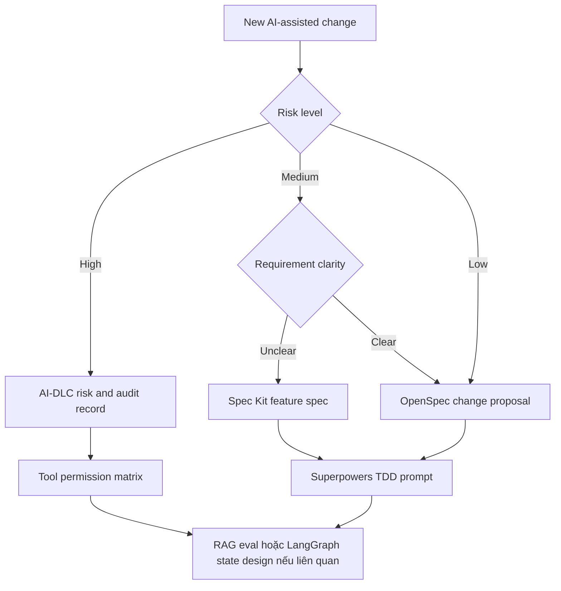

# Templates Và Starter Artifacts

Pack này biến tài liệu thành toolkit có thể dùng ngay. Dùng các template làm điểm bắt đầu cho issue, pull request, architecture note, AI-DLC record hoặc agent prompt.

## Templates có thể tải

| Template | Dùng khi | Link |
|---|---|---|
| Spec Kit feature spec | Intent còn mơ hồ và cần spec-first path | <a href="../../templates/spec-kit-spec-template.md" download>Download</a> |
| OpenSpec change proposal | Cần lightweight SDD cho change có scope rõ | <a href="../../templates/openspec-change-proposal-template.md" download>Download</a> |
| AI-DLC risk and audit record | Delivery cần governance, review và traceability | <a href="../../templates/ai-dlc-risk-audit-template.md" download>Download</a> |
| GSD phase plan | Công việc kéo dài nhiều session, agent hoặc handoff | <a href="../../templates/gsd-phase-plan-template.md" download>Download</a> |
| Superpowers TDD prompt | Muốn coding agent design, test, implement, review | <a href="../../templates/superpowers-tdd-prompt-template.md" download>Download</a> |
| LangGraph state design | Đang build stateful agent service | <a href="../../templates/langgraph-state-design-template.md" download>Download</a> |
| RAG eval checklist | Cần release gate cho RAG production | <a href="../../templates/rag-eval-checklist-template.md" download>Download</a> |
| Tool permission matrix | Cần safe tool use, audit và approval rules | <a href="../../templates/tool-permission-matrix-template.md" download>Download</a> |
| Adoption scorecard | Cần đánh giá maturity và ưu tiên cải tiến | <a href="../../templates/agent-adoption-scorecard.md" download>Download</a> |

## Template nào nên bắt buộc?

## Bundle tối thiểu khuyến nghị

| Scenario | Templates cần có |
|---|---|
| Product feature bình thường | Spec Kit feature spec hoặc OpenSpec proposal, Superpowers TDD prompt |
| RAG feature | OpenSpec proposal, RAG eval checklist, tool permission matrix |
| Stateful agent | LangGraph state design, tool permission matrix, eval checklist |
| Enterprise AI feature | AI-DLC risk/audit record, spec, tool permission matrix, release evidence |
| Internal agent platform | AI-DLC record, Hermes/tool policy notes, LangGraph state design nếu có app runtime |

## Dùng với coding agent như thế nào

1. Điền template nhỏ nhất đủ phản ánh risk.
2. Paste artifact đã điền vào issue, PR hoặc agent session.
3. Nói rõ artifact nào là source of truth.
4. Yêu cầu agent tạo plan map từng task về artifact đó.
5. Bắt buộc có test, eval hoặc review evidence trước khi coi implementation là xong.

## Quality bar của template

Template chỉ hữu ích nếu nó thay đổi hành vi. Nếu một section không ảnh hưởng đến design, testing, review hoặc release, hãy bỏ nó cho change đó. Lightweight không có nghĩa là không tài liệu; nó nghĩa là artifact nào cũng phải có lý do tồn tại.
